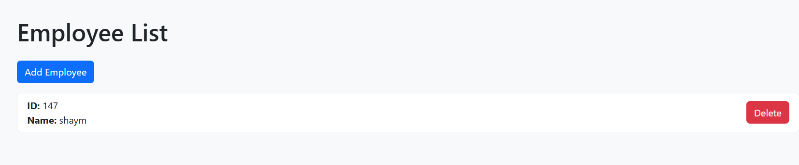

# Employee Manager Application 🚀

A 3‑tier Python Flask application with a MySQL backend that allows you to manage employees through a sleek, modern web interface. Containerized with Docker and Docker Compose, this app features real‑time logging and a responsive Bootstrap UI.

---

## Features ✨

- **CRUD Operations:**  
  Add, view, and delete employee records.
- **Real-time Logging:**  
  Logs key activities to stdout.
- **Dockerized Deployment:**  
  Simplified deployment using Docker & Docker Compose.
- **Modern Frontend:**  
  Responsive, colorful UI built with Bootstrap 5.

---

## Tech Stack 🔧

- **Backend:** Python Flask  
- **Database:** MySQL  
- **Frontend:** HTML, Bootstrap 5  
- **Containerization:** Docker, Docker Compose

---

## Prerequisites 💻

- [Docker](https://www.docker.com/) & [Docker Compose](https://docs.docker.com/compose/) installed.
- For AWS EC2 deployment, ensure Docker and Docker Compose are set up on your instance.

---

## Setup & Run Instructions 🏃‍♂️

1. **Clone the repository:**

   ```bash
   git clone <repository-url>
   cd <repository-directory>
   ```
2. **Run application**

   ```bash
   docker compose up --build
    ```
3. **Visit your browser**
    ```
    <yourip>:<port>
    ```
  
